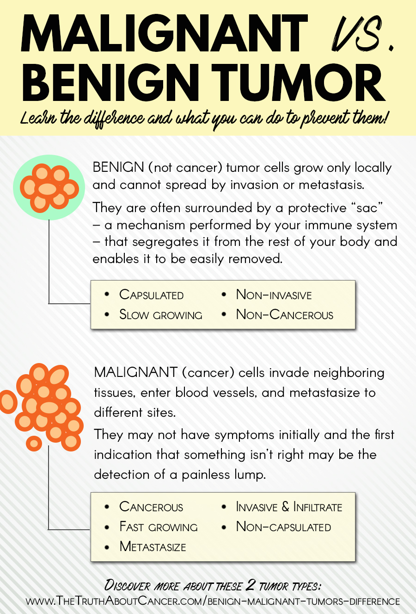

## CASE STUDY : CLASSIFY BREAST CANCER - Malignant or Benign

### Overview of Random forest algorithm
Random forest algorithm is an ensemble classification algorithm.  
Ensemble classifier means a group of classifiers.  
Instead of using only one classifier to predict the target, In ensemble, we use multiple classifiers to predict the target. 
In case, of random forest, these ensemble classifiers are the randomly created decision trees.  

<b>Problem Statement:</b> 

Build a random forest classifier using python scikit learn library to predict the Breast cancer type (Benign or Malignant). 
 
<b>Available Data:</b> 
I have used the UCI breast cancer dataset to build the random forest classifier in Python.  
You can download the data from <a href="https://archive.ics.uci.edu/ml/datasets/breast+cancer+wisconsin+(original)">UCI</a> .  

<b>The breast cancer dataset has 10 features and 1 target class.</b> 

Breast Cancer dataset features:
1. Sample code number: id number 
2. Clump Thickness: 1 - 10 
3. Uniformity of Cell Size: 1 - 10 
4. Uniformity of Cell Shape: 1 - 10 
5. Marginal Adhesion: 1 - 10 
6. Single Epithelial Cell Size: 1 - 10 
7. Bare Nuclei: 1 - 10 
8. Bland Chromatin: 1 - 10 
9. Normal Nucleoli: 1 - 10 
10. Mitoses: 1 - 10 
11. Class: (2 for benign, 4 for malignant)

Please do like and share this post if you find it useful. 

<b>Thanks and Regards, 
Rohan Shetty</b>
