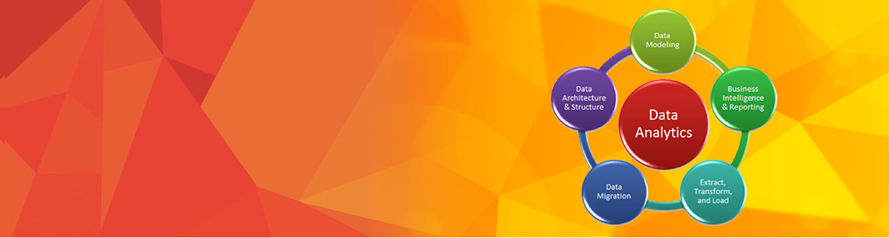

# Analytics
This repository contains files related to the projects or case-studies I have worked on in the field of Data Analytics.

## Table of Contents

### 1. Data Visualization
-- <a href="https://github.com/rohanshetty1888/Analytics/tree/master/DataVisualization/Most_Valuable_Brands">Data Visualization in R</a> 
-- <a href="https://github.com/rohanshetty1888/Analytics/tree/master/DataVisualization/Tableau">Data Visualization in Tableau</a>

### 2. Data Analysis
-- <a href="https://github.com/rohanshetty1888/Analytics/tree/master/DataAnalysis/LinearRegression">Linear Regression</a>

### 3. Big Data
-- <a href="https://github.com/rohanshetty1888/Analytics/tree/master/BigData/HIVE">HIVE</a> 
-- <a href="https://github.com/rohanshetty1888/Analytics/tree/master/BigData/PIG">PIG</a>
